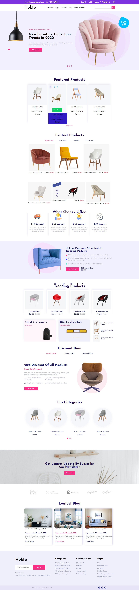
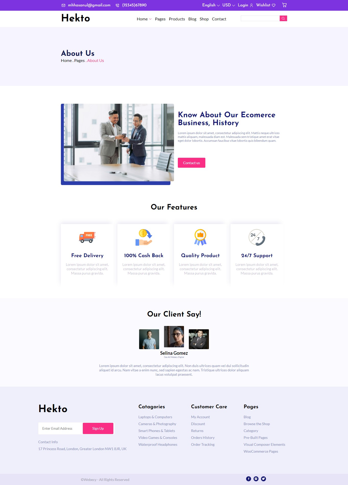

## Table of contents

- [Hekto](#Hekto)
  - [Screenshot](#screenshot)
  - [Screenshot2](#screenshot2)
  - [Screenshot3](#screenshot3)
  - [Links](#links)
- [My process](#my-process)
  - [Built with](#built-with)
  - [What I learned](#what-i-learned)
  - [Continued development](#continued-development)
  - [Useful resources](#useful-resources)
- [Author](#author)
- [Acknowledgments](#acknowledgments)

### Hekto

Users should be able to:

- View the optimal layout for the site depending on their device's screen size

### Screenshot

## Screenshot2

## Screenshot3

### Links

- Solution URL: [https://github.com/Dexie14/Grazac_challenge2.git](https://github.com/Dexie14/Grazac_challenge2.git)

## My process

### Built with

- Semantic HTML5 markup
- CSS custom properties
- Flexbox
- Desktop-first workflow

### What I learned

I learnt a lot working with html markup and css, getting used to their tags and class properties while writing this project, I indeed learnt how to use flex property and the absolute positioning to a good extent. I have alot more to learn in css though as I am growing further in th field. I really have alot to learn on javascrript as it is very important in the process

Working on this project was realling challenging as the project had a lot to do with images and their alignments. I faced alot of challenges but I got solution to few by researching on stackoverflow, w3schools and the general solutions found on google. 

### Continued development

I strongly look forward to work more on css positioning, grid, icons, animations and media query. And I look forward to reallu understanding the basic concept of (JavaScript and React) and its utilizations.

### Useful resources

- [w3schools](https://www.w3schools.com/) - This helped me to see better ways of applying my codes. I really liked their system pattern.
- [stackoverflow](https://stackoverflow.com/) - This is an amazing site which helped me to find solutions to problems I faced in working out my code.

## Author

- Github - [@Dexie14](https://github.com/Dexie14)
- Twitter - [@adeluadeoniye14](https://www.twitter.com/adeluadeoniye14)

## Acknowledgments

A very big thank you to everyone who assisted me in understanding the project better. I would also like to thank Grazac academy for providing the great opportunity to solve challenges and give a space for building up.
